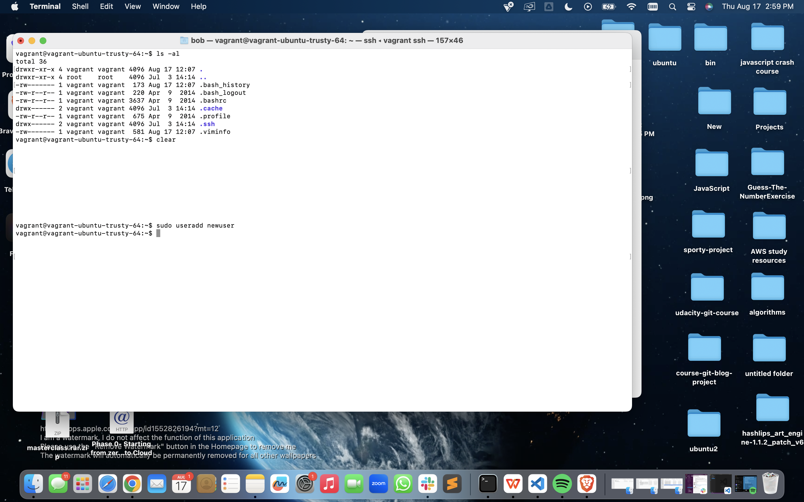
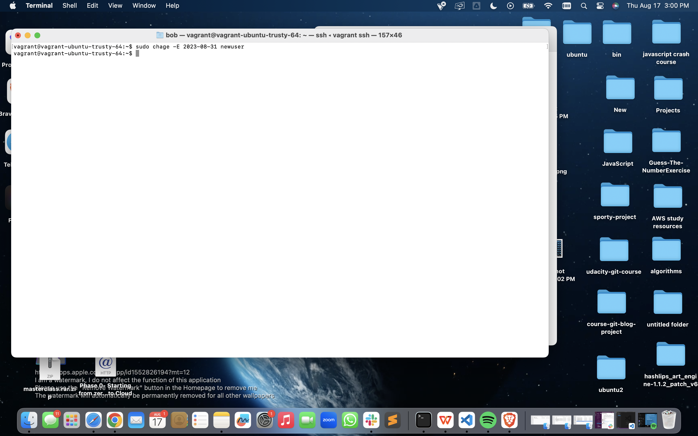
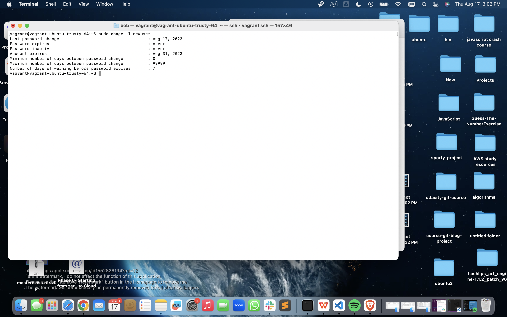
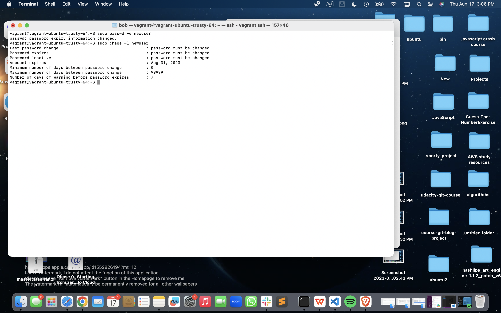
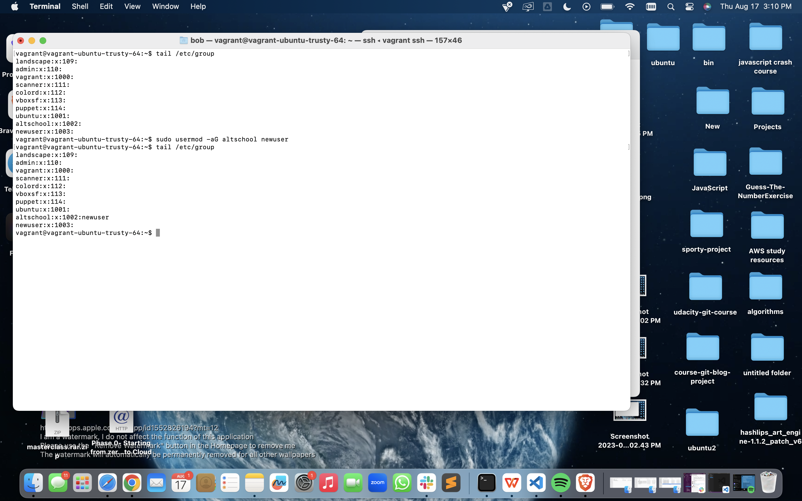
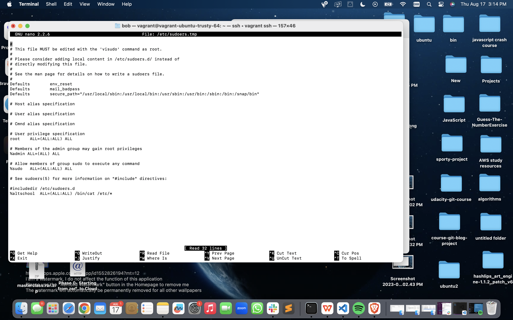
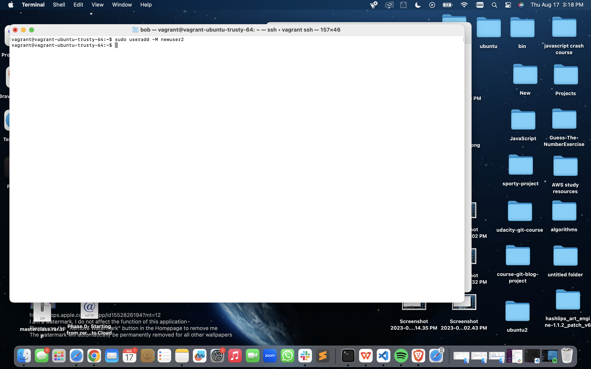

#Linux Assignment 

This image shows me creating a new user name **newuser**

This image shows me changing the expiry date of the user , set to expires two weeks from now 

This image shows me inspecting the changes i just made to the validity of the account and it displays the expiry information set to two weeks from today 

This image shows me changing the settings of my newly created user to prompt it to change password on login

This image shows me attaching the user to a group i created named **altschool**

This image shows me editing the sudo file to only enable the alschool group to only run cat command on /etc/

This image shows me creating a new user named **newuser2** which was created without a home directory 
